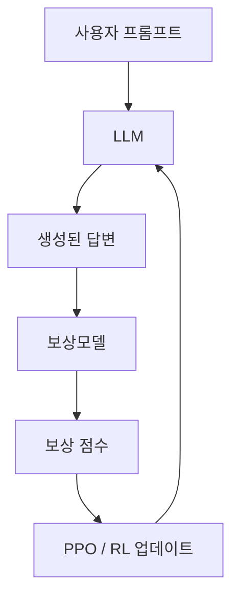

## 프로세스


## 1. 사전 학습된 보상 모델 준비
- 아래 타입의 모델 준비
	- RLHF용 Reward Model은 대부분 Decoder-Only LLM(GPT 계열) 기반
	    - 이유: Policy LLM과 아키텍처가 비슷하면 학습 안정적
	- 리소스가 제한적이면 Encoder-only(BERT 계열) 모델
	    - 작은 GPU에서도 학습 가능, 점수 예측에 충분
	- 다국어/한국어 특화 → Seq2Seq 또는 한국어 모델
## 2. 데이터셋 준비
- Pairwise 형태의 데이터 준비
```json
{
	"prompt": "모델에 주어질 질문·지시문·대화 맥락- 사람이 할만한 질문",
	"chosen": "prompt에 대한 사람이 선호하는 답변",
	"rejected": "prompt에 대한 덜 선호되는 답변"
}
```
## 3. 모델 학습시키기
## 4. 강화 학습
- 목표: 보상모델이 "좋다"고 평가하는 답변을 더 자주 생성하도록 정책을 최적화.
- 즉, `policy -> reward model 평가 -> gradient update` 순환 구조.
## 5. 안정화 과정
- PPO 학습은 불안정할 수 있으므로 KL penalty 같은 규제 필요
```python
	from trl import PPOConfig
	
	ppo_config = PPOConfig(
		model_name="pretrained-LLM",
		kl_coeff=0.1,   # KL penalty weight
		learning_rate=5e-5,
		batch_size=2
	)
```
- ➡ 할루시네이션 하지 않도록 조정
## 6. 검증 및 평가
- 강화학습으로 업데이트된 모델을 검증 데이터셋에 적용해서 보상 점수가 실제로 올라갔는지 확인
- 가능하다면 인간 평가자(Human Eval)로 품질 확인도 필요


